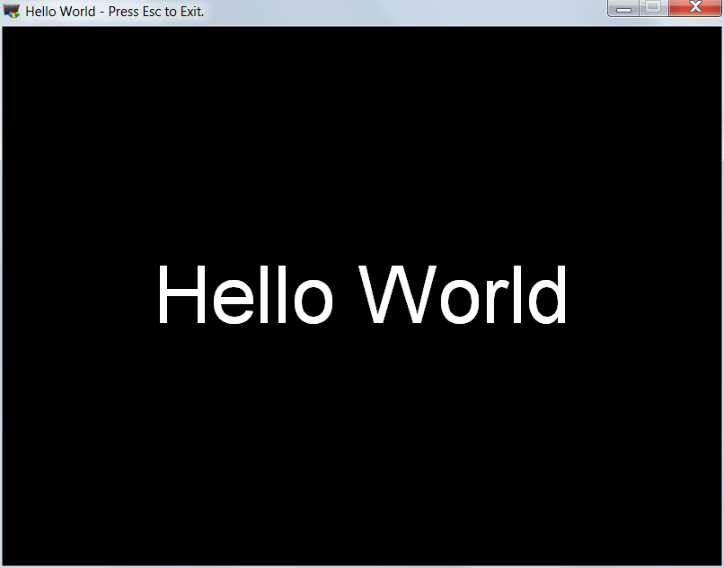
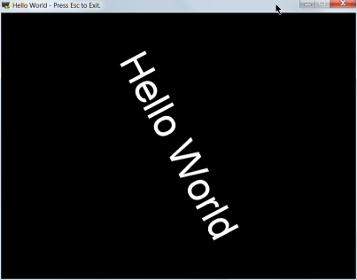
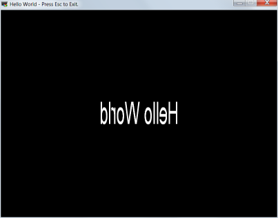
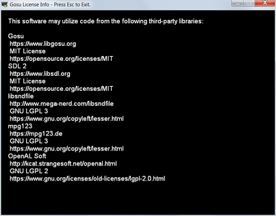

# Chapter 1 - The traditional "Hello World" with a few fun variations.

A silly tradition in the world of computer programming is to have as a first,
simple example a program the displays the text "Hello World". This tutorial is
not going to break with this tradition.

## Demo 0

If you did'nt do so already in chapter 0, lets run the first demo program:

    ruby 01\demo_00.rb

and see the first of the "Hello World" demo programs.



Press escape when we are done being amazed by the awesomeness of its "Hello"
and the worldliness of its "World"

#### High level overview:

Now we crack into the code that makes this trivial program tick. The Gosu
version of Hello World is a lot longer than the Ruby CLI version. It's hard to
beat:

```ruby
puts "Hello World"
```

So, let's retire to our luxury jet plane and look at the code from an altitude
of about 10,000 feet:

```ruby
require "gosu"

class HelloWorld < Gosu::Window
  # Classy details go here!
end

HelloWorld.new.show
```

The line require "gosu" is the standard way to extend Ruby with the new
features of the gosu gem. In object oriented programming, creating classes is
the most common way to define new behaviors. Our HelloWorld class however
inherits behaviors from the Gosu::Window class. This inheritance is a major
way that Ruby avoids so much of the boilerplate code of older systems.

The final line of code creates an instance of our HelloWorld class with new
and sends the show method to that instance. This show method is just one of
many methods we get to inherit from Gosu::Window with no effort on our part.

#### What's in this class anyway?

The HelloWorld class defines just four methods: initialize, button_down, update
and draw. Let's take a look at each in turn:

**initialize** - this method sets up our hello world window. Since this window
inherits behavior from the Gosu::Window class, we send the message to the
parent class with "super" keyword. This passes along all of the initialize
parameters as well. The next line sets the caption of window. It's the text
in the upper window bar. The final line creates an image object from the
supplied text and text size.

```ruby
def initialize(width=800, height=600, fullscreen=false)
  super
  self.caption = "Hello World - Press Esc to Exit."
  @title = Gosu::Image.from_text("Hello World", 100)
end

```
In real games, the initialize method is used to load image and sound files into
memory. Loading files is not something you want to be doing during the flow of
your game.

Also note that there are many ways this could have coded in Ruby. This is just
one example.

**button_down** - this methods responds to buttons being pressed. If the id of
the button pressed is that of the escape key, the window is closed.
```ruby
def button_down(id)
  close if id == Gosu::KbEscape
end

```

**update** - this event is sent to the window so that it can update any data
for the next frame of our game. In this simple case, we just calculate where
on the screen our text image is going to be placed.
```ruby
def update
  @x = (self.width-@title.width)/2
  @y = (self.height-@title.height)/2
end

```
A picture of how the image origin works is shown
[here](./images/demo_00_origin.png)

**draw** - this event is sent to the window so that it can actually draw stuff
on the screen. Given the coordinates calculated in the update method, the
simply send the draw message to the image object in the @title variable so that
it can do the work of drawing on the screen for us.
```ruby
def draw
  @title.draw(@x, @y, 0)
end
```

And that's it! Not a one-liner but not a 300 line monster either.

## Demo 1

I realize that the demo_00 program is **really** boring. Let's see if we can
steal a trick from the politicians bag and put a new "spin" on things. If you
fire up:

    ruby 01\demo_01.rb

you will see something like:



Now I know it's not spinning in the picture above, and I could have made a
cute animated GIF image, but to see the real thing, just run the code!

#### The new stuff:

It should be no surprise that the new program is largely the same as the old
one so we will focus on the new bits here:

**initialize** - this method is changed only by the addition on a single line
of code at the end of the method. Since we want to make our "Hello World"
message spin around, we need to track the current angle of that image. Here we
set that angle to an initial value of 0. The name theta is the Latin spelling
of the Greek word, and is often used to connote an angle.
```ruby
def initialize(width=800, height=600, fullscreen=false)
  super
  self.caption = "Hello World - Press Esc to Exit."

  @title = Gosu::Image.from_text("Hello World", 100)
  @theta = 0
end
```

**update** - this method is charged with updating values for the next draw.
The update adds one degree to the angle theta. You will also notice that the
position @x and @y are different. This is because the draw_rot method uses the
center of the image as its origin, unlike the draw method of demo_00 that uses
the top, left hand corner.
```ruby
def update
  @theta += 1
  @x = self.width/2
  @y = self.height/2
end
```

**draw** - as before, this method does that actual drawing. Here we use the
draw_rot method so we can control the angle of the displayed image.
```ruby
def draw
  @title.draw_rot(@x, @y, 0, @theta)
end
```

## Demo 2

What's that I hear? It's not spinning the right way? It should spin on another
axis, you say? Oh I see. Let's try out demo_02 then:

    ruby 01\demo_02.rb

you will see something like:



Again, this is a snapshot, to see the actual results, full of amazing spinning,
run the demo for yourself.

#### What's new here?

**update** - Added to this method is code to compute a scaling factor that
"undulates". The cos (or cosine) math function has a perfect undulation for our
needs. To prevent the origin from shifting as our message rotates, the width of
the image is scaled too.
```ruby
def update
  @scale_x = Math.cos(@theta/60.0)
  @theta += 1
  @x = (self.width-(@title.width * @scale_x))/2
  @y = (self.height-@title.height)/2
end
```
Note that @theta is in units of angle called "degrees" while the cosine function
expects units of angle called "radians". I know that the degrees tick through
about 60 degrees per second and I want a rate of about one radian per second,
so the angle in degrees is divided by 60.0 to give one radian per second.

**draw** - finally we draw our images using the previously omitted scale_x
paramater. If this were to be omitted, a factor of 1 would bw used. This would
result in no scaling. In this code, the width is scaled to the wavy undulation
of the cosine function.
```ruby
def draw
  @title.draw(@x, @y, 0, @scale_x)
end
```

## Demo 3

You didn't possibly think that we'd get through this thing without the lawyers
sticking their noses into things and messing up life for everybody, did you?
Within the Gosu documentation is a entry for the license. The entry looks
something like this:

    LICENSES =
        A block of legal copy that your game is obliged to display somewhere.

        :a_string

So in this tutorial, demo_03 displays this text. Take a look:



This demo is useful beyond demonstrating how to satisfy legal requirements. It
is also a good template for those cases where the program must display a great
deal of text, for game help for example.

Digging into this code is left as an exercise for the reader. Please see the
file demo_03.rb to see more.

## Extra Credits

This section is only of interest to historian types and those who'd rather not
be doomed to repeating the mistakes of the past. Otherwise, this section can be
seen as a platform for a rant as well as yelling at kids to get off my lawn.

In ancient times, I recall the 1989 Charles Petzold book:
[Programming the OS/2 Presentation Manager](https://www.amazon.ca/Programming-Presentation-Manager-Applications-Environment/dp/1556151705/ref=sr_1_29?ie=UTF8&qid=1535567521&sr=8-29&keywords=charles+petzold).
In particular I recall the Hello Word program. If memory serves, it was a
massive chunk of 'C' code running about six pages long. It was also convoluted,
difficult to understand, and full of cryptic Presentation Manager API calls.
I have memories of struggling to put together applications using those same
programming tools and it was pure frustration. In case you think that this was
kust an OS/2 thing, Windows 3.1 was much worse and the Win32 API started in
Windows 95 did little to really help out the situation.

So the question before us is simply this: **Why was it so bad?** Let's identify
the key villains:

#### The 'C' language:

Way back in 1989, the 'C' programming language was the undisputed king of the
programming languages. While some primitive Luddites clung to the wretched
assembly language, most recognized that high level languages, like 'C',
promoted better results through improved code clarity, fewer code defects, and
enhanced code portability. That is, except when it didn't.

Windowed graphical user interfaces (GUI) were the one of the original use cases for
the entire concept of object oriented programming (OOP). On a basic level, a
GUI entity on the screen is an object that responds to input signals or
messages from the user and other entities. In OOP, objects are entities that
are defined by how they respond to inputs or messages.

Messages sent to a window or object, have no strictly ordained order. They
occur as needed or are generated by user activity.

In 'C' this is not the case. Here things are strictly ordered by the structure
of the code. Steps occur as laid out in the code. So much so that this approach
is called "structured programming". To create a windowed environment in 'C', one
must create a message handling emulator. The responsibility for creating and
maintaining this emulator falls squarely on the programmer. Time wasted here is
time not available for doing useful, application oriented work.

In case anyone should think that this is a diatribe against 'C', it is not. I
have used that language numerous times in many embedded systems projects where
resource constraints required a lean and compact solution and the task at hand
lent itself to a structured approach. 'C' was in its element.

Using 'C' in a GUI is akin to using scissors to mow the lawn. It can be made to
work; It's just not a good idea.

#### The 'C++' language:

Around the time that 'C', and the structured programming paradigm in general,
were running out of steam, a new programming language was gaining ascendancy.
That language, the brainchild of
[Bjarne Stroustrup](http://www.stroustrup.com/), was 'C++'. One of the guiding
principles of 'C++' was that it be a compatible enhancement of 'C'. In fact,
an early 'C++' compiler (called cfront I believe) actually compiled 'C++' code
into 'C' code. This compatibility was a major advantage for 'C++' as it made
the large amounts of 'C' code available as a starting point for any new
developments.

This feature was also a major problem as well. I recall hearing the following
(sorry I cannot recall where or who) "C++ is pretty good. Too bad about all the
C." 'C++' was also a much more restrictive object oriented language. For
example class types were determined statically at compile time rather than at
runtime. To get around these and other restrictions, complex facilities such
as multiple inheritance and templates were added. Implementation by the early
compilers of the day was incomplete, bloated, slow, and riddled with bugs.

Another problem was caused by the fact that the object oriented features all
were contained in constructs in the compiler and excluded from the running
programs. This has been compared to a ghost town. Entities run as expected, but
access to even the most basic details, like what class is this? or what is this
message? are not available. This made it very difficult to connect the message
passing system of 'C++' to the messages of the window manager of the operating
system. Most often this resulted in a huge 'switch' statement, just like in
plain old 'C'.

Trying to get around these problems, many non-standard language extensions were
proposed and implemented. These only added to the confusion and the fog of
proprietary obstruction.

For cutting the lawn, motorized scissors are not always better, and can be a
great deal more dangerous.

#### The Really Awful Hardware:

If memory serves, in the early 90s, I was involved in a project to create a
sophisticate GUI based application for OS/2. The language was NOT 'C'. It was
Smalltalk. Graphical User Interface were invented under that language by Xerox
in the 80s. It was the ideal language for such work.

So if the ugliness of 'C' was not a factor, why was the development such an
agonizing death march?

It did NOT help that the language was called "Smalltalk". Explaining to
grim-faced suits that you are embarking on a costly development process in
"Smalltalk" is never going to be easy. I seriously think that the name was a
factor in the failure of that language.

Most likely, though, it was the hardware.

The hardware! We were dealing sluggish Intel 386 CPUs, on motherboards that all
maxed out at a pitiful 16Meg of memory, and dumb video cards that forced the
CPU to do all the grunt work of computing each and every pixel drawn. To be
fair, in the day, these were considered to be good machines, for those with
finite budgets.

The fact that memory manufacturers were colluding to limit the supply of memory
devices and jack up prices probably did not help either.

Like Ruby, Smalltalk is an interpreted, dynamic language. Unlike Ruby, it was
stone age primitive. The virtual machine interpreter and memory management were
all many times less stable and efficient than those in Ruby today.

In short it was really annoyingly slow, paused a lot for garbage collection,
and crashed often enough to make users of the application want to go back to
the character mode, DOS based application we were trying to replace.

The industry was in a state of transition. These machines where over-powered as
MS-DOS machines. They were completely inadequate OS/2 (or Windows/NT) machines
for anything but the most trivial tasks written in, yes, 'C'.

If your lawnmower is a plastic children's toy, the scissors may be the only way
to cut the lawn.

#### The Evil Committee of Taking Over the World:

Look, capitalism requires that corporations seek greater profits, not the
greater good. This includes companies that market and sell operating systems
and graphical user environments. In the early 90s, this included Apple, IBM,
Microsoft, and Novell. Each wanted to maximize the value of their offerings
over those of their competitors.

That meant that there was an incentive to "lock-in" applications to their
platform and to make portable code as difficult as possible.

So how did this legally mandated greed make life miserable for application
developers?

For starters, graphical user interfaces were designed to be as different and
incompatible as possible. This often meant that they were far more complex
and convoluted than necessary.

In addition, programming tools often did not correctly implement many
programming language features. Then to get around the bugs that had been added,
non-standard, incompatible extensions are added. At Microsoft this went as far
as to be the policy [Embrace, extend, and extinguish](https://en.wikipedia.org/wiki/Embrace%2C_extend%2C_and_extinguish).

Then when it came time to use tools like C++ to create encapsulation libraries
to provide an easier-to-use programming model, these were often made to provide
only an imperfect rationalization of the programming task. This was so bad that
the Microsoft Foundation Class library was said to encapsulate Windows in the
same way a baby is encapsulated by a leaky diaper...

Ewe...

The confusion that was the result of all this greed based design would not
begin to fade until open sourced software rose in importance and popularity
spearheaded by systems such as Linux, and compilers like GCC.

#### That Optimized Code Guy:

WIP


## Notes:
* All trademarks are the property of their respective owners.
