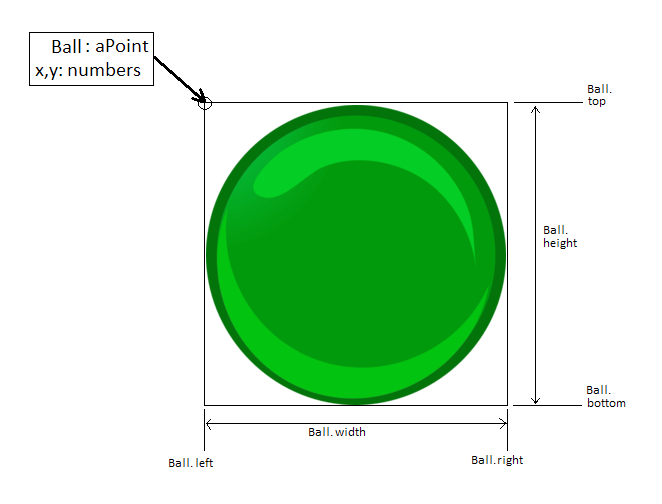

# Chapter 02 - Getting the ball rolling.

OK, now a lot of games have a ball. Well I'm sure the games themselves don't
have a ball as they are just programs and cannot experience emotions like
joy or frustration... well not YET. Further, while the players may have a ball,
many games, contain one or more balls.

While some of you may have your minds in the gutter, I am going with balls as
spherical (or ellipsoid in some cases) rubber or plastic sports equipment
objects with various sizes and elasticity. Standing up for your beliefs and
principles in the face of severe adversity and opposition isn't bad either but
that is off topic.

Were going to use the ball to get our game past the still life phase and into
some sort of movement and eventually our first interactive manipulation of
objects in our nascent game.

## Ball 0

Let's start with the first of the ball programs. It's number zero and that's a
clue as to how much it does. try:

    ruby 01\ball0.rb
    or
    games_lessons ball0

and you will get:


No, you're not missing anything. Just a ball, motionless "on the ground" at the
bottom of the screen. What has been added that is of interest here? Let's look.

**Ball#initialize** - this method still sets things up for our ball window. One
difference compared to our hello0 program is that here the image comes from a
file rather than some text.

```ruby
def initialize(width=800, height=600, fullscreen=false)
  super

  # Extract the full path to this file, excluding the file part.
  path = File.dirname(File.absolute_path(__FILE__)) + "/"

  # Load up the image of the ball.
  @ball = Gosu::Image.new(path + "images/green-ball_75x75.png")

  self.caption = "A Ball. Press Escape to exit."

  # Place the ball, on the ground.
  @x = (self.width-@ball.width)/2
  @y = self.height-@ball.height
end
```

Ruby has wonderful mechanisms for determining where things exist for its
"require" and "require_relative" commands. Gosu is simpler and needs some help
to find the right path. The line of code

```ruby
  # Extract the full path to this file, excluding the file part.
  path = File.dirname(File.absolute_path(__FILE__)) + "/"
```
computes the full path to the folder containing the ball0.rb (\_\_FILE\_\_).
This allows us to access resources relative to that folder without having to
worry about where the current working directory is or other things that can
make our code more brittle than it needs to be.

The other area to be examined is that, for this simple program, we want the
bottom of the ball image to line up exactly with the bottom of our window.
Let's take a look at a diagram of the measurements that come into play here:



Now, some of these values are given. The origin of the ball image is a point
with an x and a y component. These are set when the image is drawn on the
screen. The height and width are properties of the image itself (these can be
obtained with the height and width methods). Now the other properties are
derived from the given data. While we are interested the bottom of the ball,
let's look at all four boundaries:

```ruby
ball_left   = ball.x
ball_right  = ball.x + ball.width
ball_top    = ball.y
ball_bottom = ball.y + ball.height
```
Note: It may seem strange but the bottom of the ball value is greater than the
top of the ball value . We will deal more with this later, but for now just
accept that in Gosu, things are a bit upside-down.

Now our goal is to have window_bottom == ball_bottom. The rules for the ball
also apply to the window. However, the origin is always 0,0 for the window so
we get:

```ruby
window_left   = 0
window_right  = 0 + window.width = window.width
window_top    = 0
window_bottom = 0 + window.height = window.height
```

So:

```ruby
ball_bottom = window_bottom
```

Substituting what we know from above:

```ruby
ball.y + ball.height = window.height
```

We want to know the ball's y value so we subtract ball.height from both sides:

```ruby
ball.y = window.height - ball.height
```

This simple math lets us control where the bottom of the ball is when all we
can set is the location of the top of the ball. The same math applies for the
x position of the ball, except in this case, we want the ball to be centered
in our window.

The code in question boils down to just these few lines:

```ruby
  # Place the ball, on the ground.
  @x = (self.width-@ball.width)/2
  @y = self.height-@ball.height
```

You may note that this code is in the initialize method and not update. This is
because the position of the ball never changes in this program. In later
versions this will be the initial position of the ball.

## Ball 1

OK, now enough with the Zen still life, time to get things moving.

    ruby 01\ball1.rb
    or
    games_lessons ball1

and you will get:


Well yes, now you are missing something with this still image. No motion. Run
the demo to see the ball most certainly moving about and bouncing off the
walls. So what has changed to make this motion possible? Two methods are
changed: initialize and update.

The initialize method now sets up the initial position and velocity of the ball.

```ruby
# Set up the initial velocity. (In pixels per millisecond.)
@vx = 1
@vy = -1
```

Now velocities are express in terms of units of distance per unit of time. In
this case that is pixels per millisecond.

The update method has four responsibilities.

_First:_ It must determine how much time has elapsed since the last frame. This
is how this is done:

```ruby
# Compute the passage of time.
@new = Gosu.milliseconds
@old ||= @new
delta = @new - @old
@old  = @new
```

The value delta is the count of elapsed milliseconds. The very first frame is a
special case in that having no previous frame, no time has elapsed.

_Second:_ It updates the position of the ball based on the velocity. Here it is:

```ruby
# Compute the new proposed position.
@x += @vx * delta
@y += @vy * delta
```

Notice that it is called a "proposed" position. This is because the ball's
motion occurs in a finite space. Very soon, the ball runs out of room and hits
a boundary. This is where the third part comes in.

_Third:_  The method computes the hit or contact box of the ball. These are the
top, bottom, left, and right boundaries of the ball.

```ruby
# Compute the boundary limits.
top = @y
bottom = @y + @ball.height
left = @x
right = @x + @ball.width
```

Notice that the top and the left are simple copies of the appropriate position.
This is done for clarity.

_Fourth:_ It checks for bouncing off of the walls. That is, the hit box crossing
one of the four walls at the boundary of the screen. This is the most elaborate
chunk of code:

```ruby
# Check for collision with the left and right walls.
if left < 0
  @vx *= -1
  @x = -left
elsif right > self.width
  @vx *= -1
  @x -= 2 * (right-self.width)
end

# Check for collision with the top and bottom walls.
if top < 0
  @vy *= -1
  @y = -top
elsif bottom > self.height
  @vy *= -1
  @y -= 2 * (bottom-self.height)
end
```

The bouncing code simply determines how far into the wall that ball "wanted" to
go and positions it that far moving away from the wall. This works well since
the ball is not affected by and forces that would cause acceleration.

And that's it for new code. The draw method stills draws our ball at its
current location. It's just that this location is constantly being updated by
the update method. Our screen shows our ball zipping around and bouncing off
the walls!

In fact, for most video games, this is it! That is, most games do not go any
further in modeling the motions of objects.

## Ball 2 and Ball 3

We're not going to look at the next two demos very closely. Ball 2 adds the
force of gravity, and Ball 3 further adds the force of drag or friction.

Why not look at these further?

Simply, we are interested in creating video games, not physics simulations.
These programs attempt to create an authentic simulation of the motion of our
ball. One problem. they don't work very well. The problem is that while in
reality time flows fairly smoothly (no black holes please). In our programs it
comes in discrete chunks. This can result in truncation errors when the ball
hits a wall or the floor.

Still, feel free to look at the code for extra credits and I would be
interested in any ideas, suggestions, or improvements that may occur to you.

So what is next? Let's control our ball from the keyboard like we would in a
simple platform video game.

To do that, we will need to get a firmer grasp of input. That is the topic for
chapter 3.
